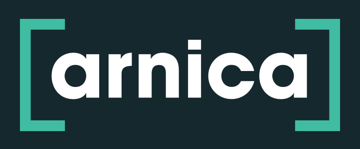

<p align="center">
  <a href="https://app.arnica.io">
    
  </a>
</p>

## Arnica Dependency Scan – GitHub Action

Extend Arnica’s security scanning into complex build environments that pull dependencies from multiple sources or compile packages from source.
When real-time checks aren’t enough, post-build scanning validates SBOMs directly from your CI/CD pipelines via API, returning pass/fail results to enforce security gates before merges or deployments. Ensure consistent policy enforcement and centralized visibility in Arnica’s dashboard, even for environments with intricate dependency resolution.

### Quickstart

Add a workflow that runs on PR events and merges to SLA branches for complete security coverage.

```yaml
name: Arnica Dependency Security Scan
on:
  pull_request:
    types: [opened, synchronize]
  push:
    branches: [main, develop, staging, production] # Add your SLA branches
  workflow_dispatch:

jobs:
  security-scan:
    runs-on: ubuntu-latest
    permissions:
      contents: read
    steps:
      - name: Checkout repository
        uses: actions/checkout@v4
        with:
          persist-credentials: false

      - name: Dependency Security Scan with Arnica
        id: arnica
        uses: arnica-io/dependency-scan@4aa5148d03e13b5082a5d1a0c8b00ad7946f8bb3 # v1.0.24
        env:
          ARNICA_API_TOKEN: ${{ secrets.ARNICA_API_TOKEN }}
        with:
          repository-url: ${{ github.server_url }}/${{ github.repository }}
          branch: ${{ github.head_ref | github.ref_name }} # Uses the PR source branch for pull requests, or the current branch for pushes
          scan-path: .

      - name: Print scan results
        run: |
          echo "Scan ID: ${{ steps.arnica.outputs['scan-id'] }}"
          echo "Status: ${{ steps.arnica.outputs.status }}"
```

### Pinning to a Commit SHA

While Arnica's action tags are immutable, as a general best practice we recommend pinning all GitHub Actions to a full commit SHA rather than a tag. SHA pinning ensures your workflows are deterministic and aligned with [GitHub's security hardening guidelines](https://docs.github.com/en/actions/security-for-github-actions/security-guides/security-hardening-for-github-actions#using-third-party-actions).

```yaml
# Best practice – pinned to commit SHA
uses: arnica-io/dependency-scan@4aa5148d03e13b5082a5d1a0c8b00ad7946f8bb3 # v1.0.24
```

The SHA for each release is listed on the [Releases](../../releases) page. This README is automatically updated with the latest SHA on every release.

### Recommended Workflow Triggers

For complete security coverage and accurate issue lifecycle tracking:

- **Pull Requests**: `opened`, `synchronize` - Catches issues before merge
- **Main/Release Branches**: `push` to `main`, `develop`, `staging`, `production`
- **Build Pipelines**: Add to any workflow where code is built or deployed
- **Manual Runs**: `workflow_dispatch` for on-demand scans

### Where to View Reports

Security scan results appear in multiple locations:

1. **GitHub Step Summary**: Detailed findings report in the workflow run
2. **Arnica Dashboard**: Full vulnerability management at `https://app.arnica.io`
3. **Workflow Logs**: Console output with scan details
4. **PR Comments** (if configured): Summary posted to pull requests

### Inputs

| Name                   | Required | Default                     | Description                                                                |
| ---------------------- | :------: | --------------------------- | -------------------------------------------------------------------------- |
| `repository-url`       |   Yes    |                             | Repository URL associated with the scan                                    |
| `branch`               |   Yes    | `main`                      | Branch to associate with the scan                                          |
| `scan-path`            |   No     |  `.`                        | Directory path to scan and generate SBOM for (e.g., `.` or `services/api`) |
| `api-base-url`         |    No    | `https://api.app.arnica.io` | Arnica API base URL                                                        |
| `api-token`            |    No    |                             | Arnica API token; prefer secret env `ARNICA_API_TOKEN`                     |
| `scan-timeout-seconds` |    No    | `900`                       | Timeout (seconds) to wait for scan completion                              |
| `on-findings`          |    No    | `fail`                      | Behavior when findings are detected: fail, alert, or pass                  |

### Outputs

- **scan-id**: Arnica scan identifier.
- **status**: Final status, one of `Success`, `Failure`, `Error`, `Skipped`, or `Timeout`.

### Environment variables

- **ARNICA_API_TOKEN**: Alternative to the `api-token` input. Recommended to pass via `${{ secrets.ARNICA_API_TOKEN }}`.

### Permissions

This action does not require repository write permissions. For least privilege, set:

```yaml
permissions:
  contents: read
```

### Examples

Scan a subdirectory and alert (do not fail) on policy violations:

```yaml
- name: Generate SBOM and scan with Arnica
  id: arnica
  uses: arnica-io/dependency-scan@4aa5148d03e13b5082a5d1a0c8b00ad7946f8bb3 # v1.0.24
  env:
    ARNICA_API_TOKEN: ${{ secrets.ARNICA_API_TOKEN }}
  with:
    repository-url: https://github.com/owner/repo
    branch: ${{ github.ref_name }}
    scan-path: services/payments
    on-findings: alert
```

### Prerequisites

- Sign in to Arnica with a privileged `admin` account. Sign in at `https://app.arnica.io`.

### API key and permissions

Create an Arnica API key with only the SBOM scopes:

1. Navigate to Admin → API.
2. Create a new API key.
3. Select scopes: `sbom-api:read` and `sbom-api:write` only.
4. Store the token as a repository secret named `ARNICA_API_TOKEN`.

---

## Azure DevOps Pipelines

The same scan logic works in Azure DevOps via `npx` — no git clone, no service connections, no script downloads.

### Prerequisites (Azure DevOps)

1. **ARNICA_API_TOKEN**: Create a **Variable Group** named `arnica-secrets` in your Azure DevOps project (**Pipelines > Library**) containing the token as a secret variable.
2. **Node.js 24+**: Add a `NodeTool@0` task to your pipeline.

### Quickstart (Azure DevOps)

```yaml
trigger:
  branches:
    include:
      - main

pool:
  vmImage: "ubuntu-latest"

variables:
  - group: arnica-secrets

steps:
  - checkout: self

  - task: NodeTool@0
    inputs:
      versionSpec: "24.x"

  - script: npx @arnica-io/dependency-scan@1
    displayName: "Arnica Dependency Scan"
    env:
      ARNICA_API_TOKEN: $(ARNICA_API_TOKEN)
```

The scan auto-detects the Azure DevOps environment and reads the repository URL and branch from built-in pipeline variables.

### Environment Variables

All configuration is via environment variables in the pipeline step:

| Name                       | Required | Default                     | Description                                                   |
| -------------------------- | :------: | --------------------------- | ------------------------------------------------------------- |
| `ARNICA_API_TOKEN`         |   Yes    |                             | Arnica API token                                              |
| `INPUT_SCAN_PATH`          |   No     | `.`                         | Directory path to scan (e.g., `services/api`)                 |
| `INPUT_API_BASE_URL`       |   No     | `https://api.app.arnica.io` | Arnica API base URL                                           |
| `INPUT_SCAN_TIMEOUT_SECONDS` |  No    | `900`                       | Timeout (seconds) to wait for scan completion                 |
| `INPUT_ON_FINDINGS`        |   No     | `fail`                      | Behavior when findings are detected: `fail`, `alert`, `pass`  |
| `INPUT_DEBUG`              |   No     | `false`                     | Enable verbose debug logs                                     |

### Example: Scan Subdirectory, Alert Only

```yaml
- script: npx @arnica-io/dependency-scan@1
  displayName: "Arnica Dependency Scan"
  env:
    ARNICA_API_TOKEN: $(ARNICA_API_TOKEN)
    INPUT_SCAN_PATH: "services/payments"
    INPUT_ON_FINDINGS: "alert"
```

### Where to View Reports (Azure DevOps)

1. **Pipeline Extensions Tab**: Scan summary is uploaded as a task summary attachment
2. **Arnica Dashboard**: Full vulnerability management at `https://app.arnica.io`
3. **Pipeline Logs**: Console output with scan details

---

### Contributing

See `CONTRIBUTING.md` for development, testing, and release guidance. Please open an Issue first for substantial changes.

### Code of Conduct

This project adheres to a Code of Conduct. By participating, you agree to uphold it. See `CODE_OF_CONDUCT.md`.

### License

MIT — see `LICENSE.md`.

### Support

Questions or issues? Open a GitHub Issue. You can also propose enhancements via a feature request Issue or PR.
